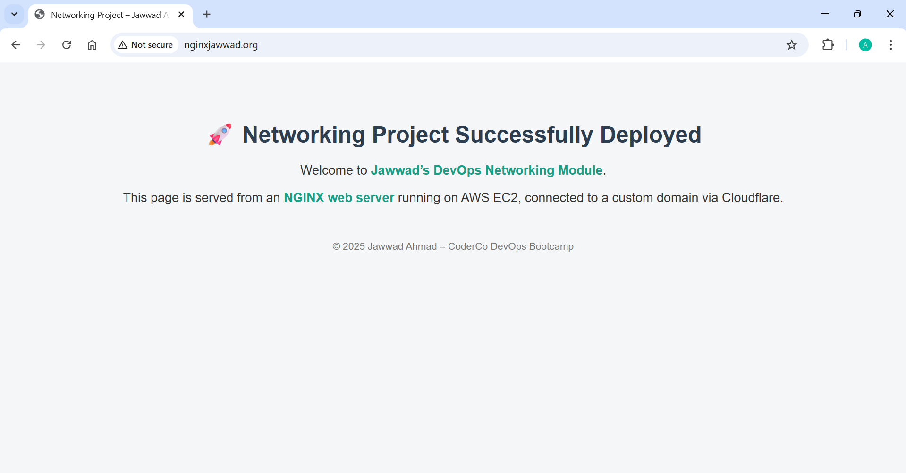

# 🚀 Deploying an NGINX Web Server on AWS EC2 with a Custom Domain using Cloudflare 🌐

For this Networking module, I deployed my own NGINX web server on an AWS EC2 instance and connected it to a custom domain purchased through Cloudflare.

In this write-up, I’ll walk you through every stage of the process: from buying the domain to setting up DNS records, configuring the server, and customising the landing page. 

---

## 🌍 Live Demo
**Visit my project:** http://nginxjawwad.org/  
*(This demo will only be live temporarily for the Networking module)*

---
