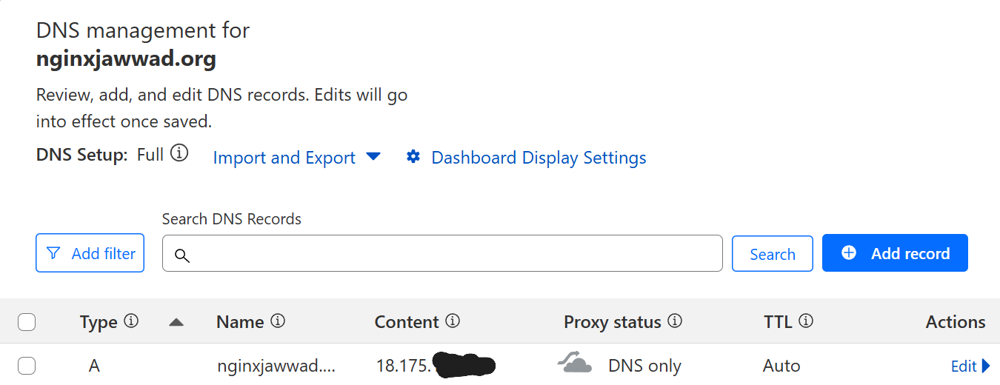
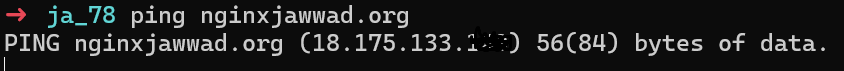

# 🚀 Deploying an NGINX Web Server on AWS EC2 with a Custom Domain using Cloudflare 🌐

For this Networking module, I deployed my own NGINX web server on an AWS EC2 instance and connected it to a custom domain purchased through Cloudflare.

I’ll walk you through every stage of the process: from buying the domain to setting up DNS records, configuring the server, and customising the landing page. 

---

## 🌍 Live Demo
**Visit my project:** http://nginxjawwad.org/  
*(This demo will only be live temporarily for the Networking module)*


---

## Stage 1 – Purchased a Domain

I bought a domain using **Cloudflare** to use for my NGINX web server project.

**Steps:**
1. Logged into Cloudflare.
2. Purchased a new domain name.
3. Prepared it for linking to my server later.


## Stage 2 – Launched EC2 Instance and Installed NGINX

I set up an AWS EC2 instance and installed NGINX to serve web content.

**Steps:**
1. Opened AWS EC2 dashboard.
2. Launched a new instance using Amazon Linux 2.
3. Selected t2.micro (free tier) instance type.
4.  Configured security group rules to allow inbound HTTP (port 80) from 0.0.0.0/0.
5. Connected using AWS EC2 Instance Connect in the browser.
6. Installed NGINX by running these commands:

   ```bash
   sudo yum -y install nginx
   sudo systemctl start nginx
   sudo systemctl enable nginx

7. I then confirmed if nginx was running :
 
    ```bash
    systemctl status nginx

## Stage 3 – Linked DNS to EC2 Instance

I connected my Cloudflare domain to the EC2 instance so the site could be reached via the domain name

**Steps:**
1. Logged into Cloudflare and opened the DNS settings.
2. Added an **A record**:
   - Name: @
   - IPv4 address: EC2 public IPv4
   - Proxy status: DNS only
3. Waited a short time for the DNS changes to take effect




## Stage 4 – Verified DNS and Connectivity

I checked that the domain points to my EC2 and that it’s reachable.

**Steps:**
1. Looked up the A record:
   ```bash
   nslookup nginxjawwad.org
   # or for a shorter version
   dig +short nginxjawwad.org

2. Tested basic connectivity:

  ```bash
  ping  nginxjawwad.org
  ```


3. Opened the domain in a browser to confirm the NGINX page loads.



## Stage 5 – Customised the NGINX Landing Page

I replaced the default NGINX welcome page with my own custom HTML page.

**Steps:**
1. Navigated to the NGINX web root:
   ```bash
   cd /usr/share/nginx/html

2. Backed up the original file:
sudo mv index.html index.html.bak

3. Created a new index.html file with my own design.

4. Reloaded NGINX:
sudo systemctl reload nginx

5. Opened the domain in a browser to confirm my custom page was live.
---

### **Struggles I Faced**
```markdown
## Challenges Faced During the Project

While working on this project, I ran into a couple of issues:

1. **Cloudflare Proxy Setting**  
   After linking my DNS to EC2, the site wouldn’t load correctly.  
   I realised that the Cloudflare’s proxy (orange cloud) was causing the issue for my setup.  
   Turning it off so it showed “DNS only” fixed the problem.

2. **Installing NGINX**  
   Initially, I had some confusion about the correct commands to install and start NGINX on Amazon Linux 2.  
   After a bit of troubleshooting and following the correct steps, I got it installed and running successfully.
